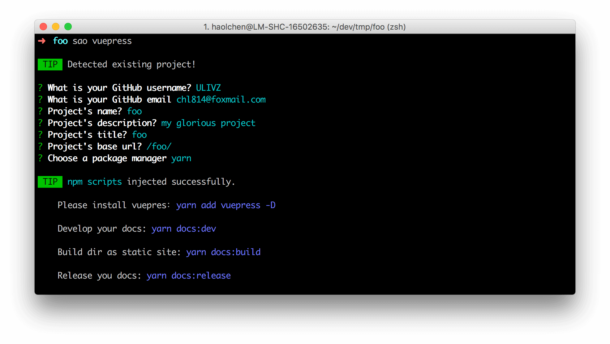

<h1 align="center">template-vuepress</h1>

<p align="center">
  Scaffold out a VuePress project.
</p>

<p align="center">
<a href="https://npmjs.com/package/template-vuepress"></a> <a href="https://npmjs.com/package/template-vuepress"></a> <a href="https://circleci.com/gh/ulivz/template-vuepress"></a> <a href="https://github.com/ulivz/donate"></a>
</p>

<p align="center">
  
</p>

> Create a VuePres project with [SAO](https://github.com/egoist/sao).

## 

## Features

- Support for use in new or old projects
- [Sidebar](https://vuepress.vuejs.org/default-theme-config/#sidebar) config generation out of box
- NPM scripts injection
- Friendly user guide
- [Github Pages](https://vuepress.vuejs.org/guide/deploy.html#github-pages) release integration

## Usage

Install [SAO](https://github.com/egoist/sao) first.

```bash
yarn global add sao
# or
npm i -g sao
```

### From npm

```bash
sao vuepress my-project
```

### From git

```bash
sao ulivz/template-vuepress my-project
```

## License

MIT &copy; [ULIVZ](https://github.com/ulivz)
